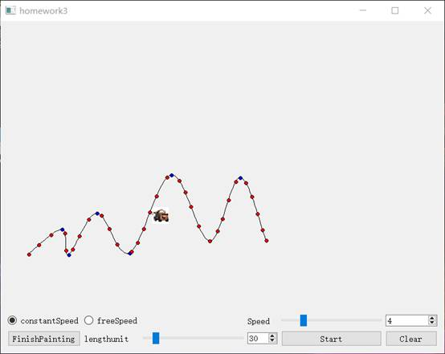

# computer-animation-work
1.This is a homework of my computer animations,baciclly it's a realization of arc-length parameterization base on Cardinal Spline Curves in order to make a object moving along the given curves with uniform velocity.You can draw your curves on desktop.
2.It's really simple ,but you need Qt5Cored.dll  and Qt5Guid.dll and Qt5Wiggetds.dll to run it.
>The reslut should be like this.

